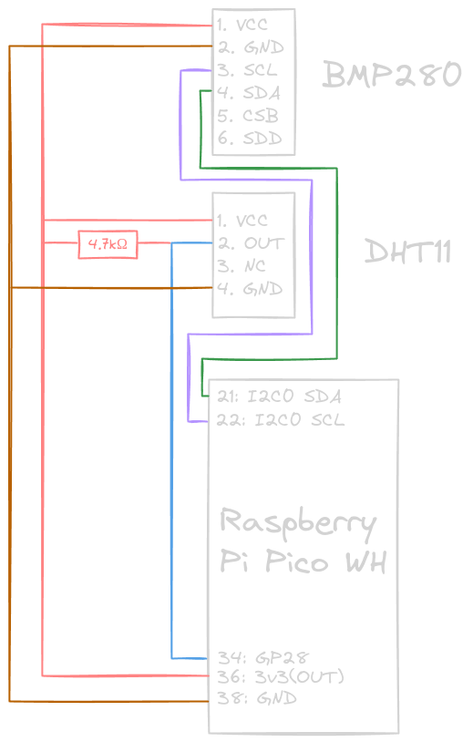
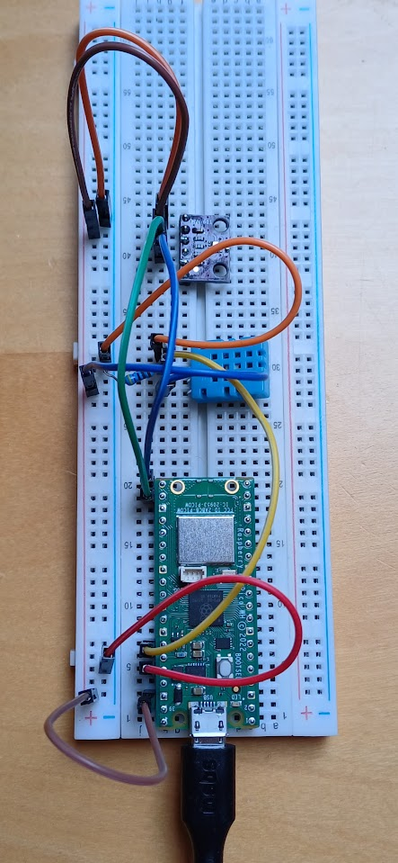
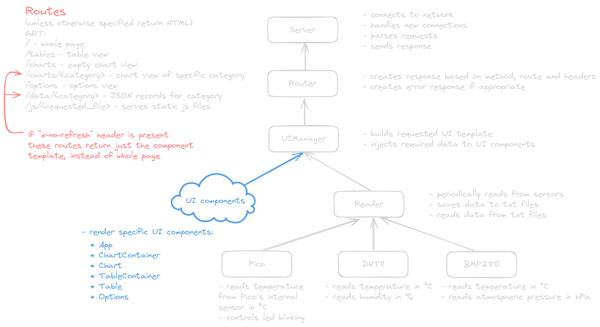
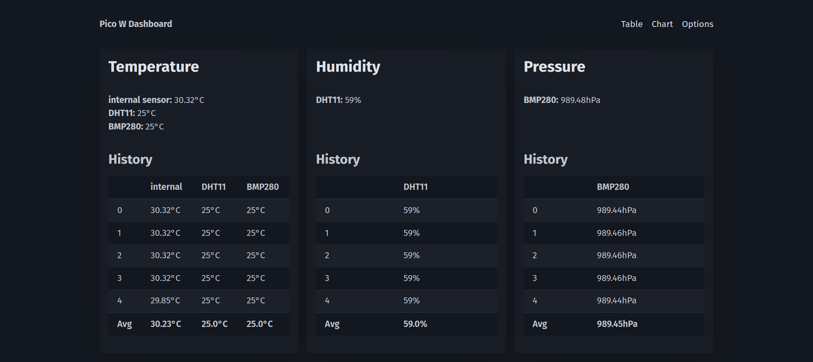
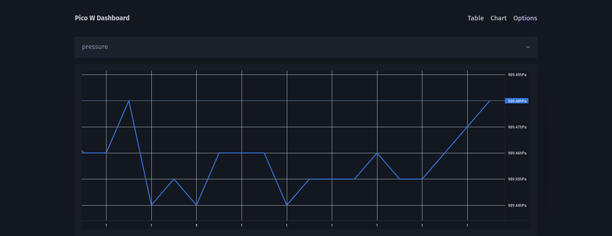
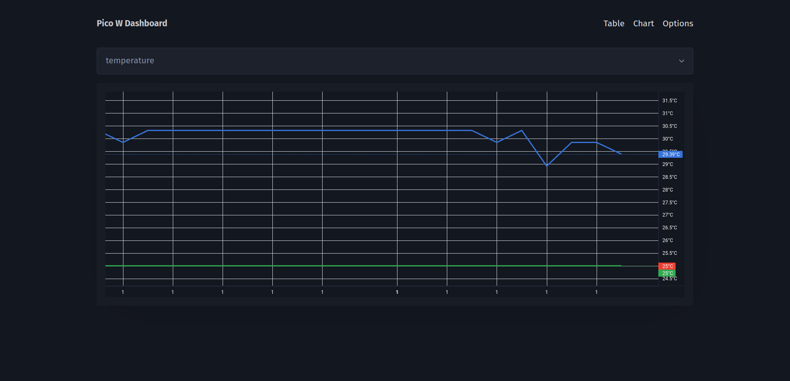

# Raspberry Pi Pico Meteo Station

Full-stack web application for Raspberry Pi Pico WH, displaying data gathered
from connected sensors in the form of an interactive dashboard.

## Technologies used

I used the hottest tech stack in the web-apps-for-microcontrollers world:

- MicroPython
- Txt
- Vanilla JS
- Pico CSS
- Lightweight Charts

## Circuit

|            Schema            |                  Result                  |
| :--------------------------: | :--------------------------------------: |
|  |  |

## Software architecture

The server has been implemented according to this very serious UML diagram:



### Notes

#### SSR vs CSR

As you can see, the web dashboard is implemented using Server Side Rendering and
HTML As The Engine Of State (mostly) with some JS to prevent additional page
refreshes. The reason behind this decision is I have recently been reading too
much about htmx and React Server Components. If you're considering writing your
own application based on this one, **I suggest implementing your own frontend as
a SPA with a fully JSON API**, as rendering templates on the Pico is expensive
and may lead to memory shortages.

#### Manual garbage collection

Additionally, if you're creating a lot of temporary objects, make sure to
manually trigger garbage collection to prevent memory fragmentation:

```python
# server.py
import gc
# this runs after sending responses to clean up all UI component objects
gc.collect()
```

## Preview





## Credits

[dafvid/micropython-bmp280](https://github.com/dafvid/micropython-bmp280/tree/master) -
custom driver for BMP280
