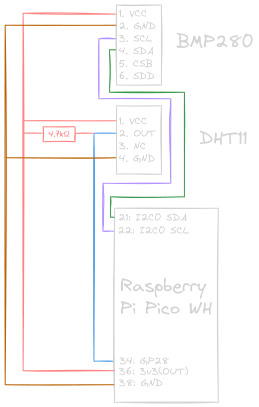
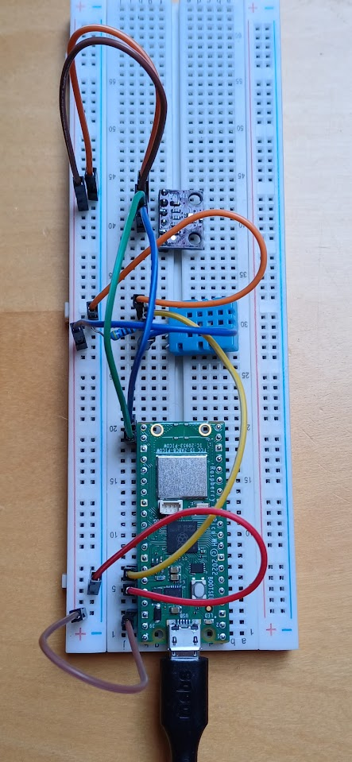
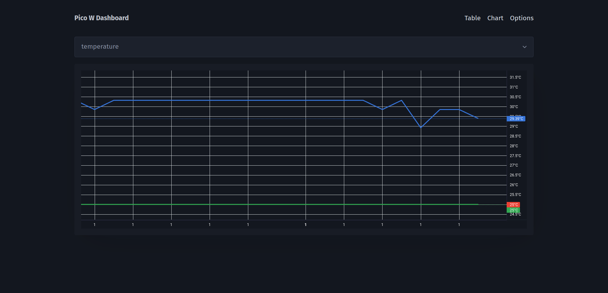

# Stacja pomiarowa dla Raspberry Pi Pico

**Autor:** Marcin Żurawel  
**Przedmiot:** Złożone Systemy Cyfrowe  
Aplikacja webowa na Raspberry Pi Pico, służąca do pomiarów i wyświetlania
zebranych z czujników danych w formie interaktywnego dashboardu.

## Użyte technologie i podzespoły

Celem projektu było zrealizowanie w pełni funkcjonalnej aplikacji webowej w jak
najbardziej niskopoziomowy sposób, czyli korzystając tylko ze standardowej
biblioteki w wybranych językach.

### Serwer

Do napisania serwera skorzystałem z MicroPythona, czyli implementacji Pythona na
mikrokontrolery. Do odczytywania pomiarów użyłem sterowników, które dostarcza
MicroPython, a także jednego dodatkowo pobranego
([dafvid/micropython-bmp280](https://github.com/dafvid/micropython-bmp280/tree/master)).
Użytą "bazą danych" są pliki txt, gdzie zapisuję odpowiednio sformatowane
rekordy.

### Klient

Frontend został napisany korzystając z JavaScriptu i HTMLa, oraz bibliotek
PicoCSS (podstawowe stylowanie elementów) i Lightweight Charts (wyświetlanie
danych w formie wykresu).

### Układ cyfrowy

Do stworzenia układu skorzystałem z płytki breadboard, ułatwiającej tworzenie
prototypu. Na niej umieściłem mikrokontroler Raspberry Pi Pico WH, czyli Pi Pico
w wersji z kartą sieciową umożliwiającą podłączanie do WiFi i wlutowanymi
headerami. Do niej podłączyłem czujniki DHT11 (pomiar temperatury i wilgotności)
BMP280 (pomiar temperatury i ciśnienia atmosferycznego).

### Inne

Do ułatwienia najczęstszych operacji na mikrokontrolerze (ładowanie plików,
uruchamianie REPL, konfigurowanie WiFi) przygotowałem skrypt Bash.

## Projekt układu cyfrowego

|           Schemat            |                  Wynik                   |
| :--------------------------: | :--------------------------------------: |
|  |  |

## Architektura oprogramowania

### Diagram

Serwer został zaimplementowany zgodnie z następującym diagramem:


### Wynik




## Wnioski

### Użyte sensory

Wykorzystałem sensory korzystające zarówno z komunikacji I2C (BMP280) jak i
Serial (DHT11). Było to na pewno edukacyjne doświadczenie, jednak w przyszłości
prawdopodobnie postawię na czujniki komunikujące się przez I2C, z powodu
łatwiejszego wykorzystania po stronie oprogramowania i dodatkowych podzespołów
(do podłączenia DHT11 musiałem skorzystać z dodatkowego rezystora). Kolejnym
problemem z DHT11 była niska dokładność czujnika, która nie pozwalała na
odczytywanie zmian w wynikach odczytu w czasie rzeczywistym (przy małych
zmianach). Jedynym problemem z BMP280 był brak fabrycznie wlutowanych pinów.

### SSR a CSR

Przy projektowaniu aplikacji zdecydowałem się na użycie Server Side Rendering,
czyli renderowaniu strony po stronie serwera oraz HTML As The Engine Of State,
czyli przechowywaniu stanu aplikacji (w większości) jako HTML. Zaletami tego
rozwiązania było otrzymanie dobrze ustrukturyzowanego kodu, przejrzyste
zarządzanie stanem aplikacji oraz wyróżnione URL dla każdego widoku na stronie.
Ponadto udało się zachować zaletę SPA (Single Page Application) dzięki
skorzystaniu z częściowego renderingu (nagłówek "x-no-refresh"). Wadami było
obciążenie serwera renderowaniem UI, co wiązało się z problemami z pamięcią
mikrokontrolera oraz zdecydowanie utrudniona implementacja - MicroPython nie ma
wbudowanego wsparcia dla template'ów, a po stronie klienta normalnie używa się
biblioteki htmx, której część cech musiałem zaimplementować własnoręcznie.

### Manualne uruchamianie garbage collection

Dużym problemem było zapełnienie pamięci podręcznej płytki gdy aplikacja
działała przez dłuższy czas. Okazało się, że wynikiem było wielokrotne tworzenie
tymczasowych obiektów - szczególnie komponentów UI, które były tworzone przy
każdym zapytaniu. Prowadziło to do fragmentacji pamięci, ponieważ garbage
collection MicroPythona uruchamia się dopiero w przypadku gdy pamięć osiągała
ustalony poziom zapełnienia, a nie gdy obiekt przestawał być potrzebny.
Rozwiązaniem problemu było manualne uruchamianie garbage collection po
obsłużeniu każdego zapytania:

```python
# server.py
import gc
# po obsłużeniu zapytania wyczyść niepotrzebne obiekty
gc.collect()
```

### Źródła

https://datasheets.raspberrypi.com/picow/connecting-to-the-internet-with-pico-w.pdf
https://datasheets.raspberrypi.com/pico/raspberry-pi-pico-python-sdk.pdf
https://docs.micropython.org/
https://github.com/micropython/micropython/issues/8736
https://github.com/orgs/micropython/discussions/9096
https://forum.micropython.org/viewtopic.php?t=9369
https://medium.com/@chirag.singla/http2-pipelining-and-multiplexing-7208572cf37e
https://www.halvorsen.blog/documents/technology/iot/pico/pico_temperature_sensor_builtin.
php https://mathspp.com/blog/sockets-for-dummies
https://docs.python.org/3/howto/sockets.html
https://thesolderingstation.com/how-to/how-to-solder-header-pins/
https://electrocredible.com/raspberry-pi-pico-serial-uart-micropython/
https://www.instructables.com/DHT11-With-Raspberry-Pi-Pico/
https://forums.raspberrypi.com/viewtopic.php?t=222791
https://docs.micropython.org/en/latest/esp8266/tutorial/dht.html
https://randomnerdtutorials.com/raspberry-pi-pico-dht11-dht22-micropython/
https://randomnerdtutorials.com/raspberry-pi-pico-w-asynchronous-web-server-micropython/
https://electrocredible.com/bmp280-raspberry-pi-pico-micropython-guide/
https://stackoverflow.com/questions/14081189/how-to-parse-a-post-requests-body
https://stackoverflow.com/questions/73720122/how-does-parsing-the-multipart-form-data-http-request-work
